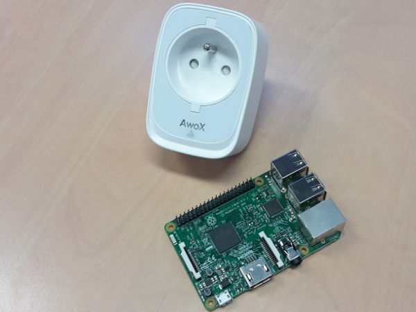

# smartplugctl

Little utility for control Awox BLE smartPlug. Test with Bluez 5 and Raspberry
Pi. Also test on amd64 debian jessie.

## Read first

Two scripts is provide here to deal with the plug(s): smartplugscan for find 
the plug address and smartplugctl to send command to it (on/off/read status). 
This 2 scripts use SmartPlugSmpB16 python module for manage Bluetooth Low 
Energy exchanges.

An older release of smartplugctl use bluez gatttool commmand line utility to do 
the stuff. In this script bluepy module is not require, it is available under 
old_scripts/.

### Require

Python module bluepy (https://github.com/IanHarvey/bluepy) is require. You can 
install it with :

    sudo apt-get install -y python-pip libglib2.0-dev
    sudo pip install bluepy

### Setup

    sudo apt-get install -y python-setuptools
    git clone https://github.com/sourceperl/smartplugctl.git
    cd smartplugctl
    sudo python setup.py install

### Find a plug

    sudo smartplugscan

### Turn plug on

    smartplugctl 98:7B:F3:34:78:52 on

### Turn plug off

    smartplugctl 98:7B:F3:34:78:52 off

### Read plug status (on/off, power level and grid voltage)

    smartplugctl 98:7B:F3:34:78:52 status

### Read hourly consumption history (24 hours from now)

    smartplugctl 98:7B:F3:34:78:52 history_hour

### Read daily consumption history (30 days from today)

    smartplugctl 98:7B:F3:34:78:52 history_day

### Manage plug LED (usefull for bedroom)

Turn off:

    smartplugctl 98:7b:f3:34:78:52 light_enable off

Turn on:

    smartplugctl 98:7b:f3:34:78:52 light_enable on

### Set plug date/time

    smartplugctl 98:7B:F3:34:78:52 set_time

This is required for good plug program schedule.

### Update a program

    smartplugctl 98:7B:F3:34:78:52 program_update 0 - 13:23

Update first program for no switch on and switch off at 13h23.

    smartplugctl 98:7B:F3:34:78:52 program_update 1 10:10 13:23

Update second program for switch on at 10h10 and switch off at 13h23.

### Enable / disable a program

    smartplugctl 98:7B:F3:34:78:52 program_enable 0 on

Enable first program.

    smartplugctl 98:7B:F3:34:78:52 program_enable 1 on

Disable second program.

### Delete a program

    smartplugctl 98:7B:F3:34:78:52 program_delete 0

### Add program example

Set plug on at 10:00 and off at 10:10 :

    smartplugctl 98:7B:F3:34:78:52 set_time
    smartplugctl 98:7B:F3:34:78:52 program_update 0 10:00 10:10
    smartplugctl 98:7B:F3:34:78:52 program_enable 0 on

Check program list to ensure all is ok :

    smartplugctl 98:7B:F3:34:78:52 program_read

### Help

    smartplugctl -h

## Python module

Alternatively to smartplug scripts you can directly use module from python code.

### Usage example

    # cycle power then log plug state and power level to terminal
    import pySmartPlugSmpB16
    import time

    # connect to the plug with bluetooth address
    plug = pySmartPlugSmpB16.SmartPlug('98:7B:F3:34:78:52')

    # cycle power
    plug.off()
    time.sleep(2.0)
    plug.on()

    # display state and power level
    while True:
        (state, power, voltage) = plug.status_request()
        print('plug state   = %s' % ('on' if state else 'off'))
        print('plug power   = %d W' % power)
        print('plug voltage = %d V' % voltage)
        time.sleep(2.0)
